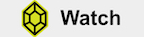

You've found my collection of past and upcoming public speaking engagements. A good speaker always has their audience's best interest at heart. My goal is to educate, inspire, motivate and entertain. If you have an upcoming conference or meetup that you think I would be a good fit for, please contact me.

### We Need Someone Technical on the Call
_Sin City Ruby 2022_

A DM. The dreaded message. “They want someone technical on the call.” 

If that statement is terrifying, never fear. Being effective at these interactions can be a big opportunity for your 
career. Learn tactics on when to commit to calls and how to execute them while empowering your team, conserving your 
time and acing the follow through. 

This talk was not recorded but a joy to give. I'd love to give it again. Please contact me. 

### Gemless
_WNB.rb 2021_

Lessons learned as an Engineering Lead during a project to build a lightweight script using AWS Lambda and Cloudwatch 
to funnel data from a variety of sources into S3 to create a data dashboard.

	

### I'm Altering the Deal
_ParisRB 2020_

Imagine your legacy production Ruby application is highly dependent on a third-party API as you learn your vendor 
deprecates your current connection. What do you do when you're forced to make a change? Accept the challenge by 
embracing abstractions, switching libraries, feature flags, edge-case testing while developing new features. Game on.

	

### Hire Me: I'm Excellent At Quitting
_Rubyconf 2019_

You have the right to be happy at work — why would we want it to be any other way? As our careers as Ruby developers 
flourish, amazing new opportunities will require you to quit a job that you may love or loathe. It's OK to quit. 
If you want to learn how to gracefully leave your job with a solid game plan, an educated successor, and without 
burning bridges, this talk is for you.

	

### Rails Against the Machine
_Southeast Ruby 2018 | Rubyconf Malaysia 2018 | Ruby on Ice_

What should a development team do when a few bad users threaten their application? Online businesses are plagued with 
trolls and bots. Learn how your team can leverage features from RoR and AWS to monitor and (secretly) segment bad actors
using automation and behavioral triggers.

	

### Draw A Crowd
_Isle of Ruby 2018 | Railsconf 2018_

Contextual Camouflage is an open-source gallery art installation built in RoR that guides visitors to anonymously report 
mental health disorders that affect themselves or their relationships. After users submit a disorder, they have the 
option to include anecdotes and demographic data for intervention researchers. The data is molded into an interactive 
real-time display using ActionCable. Come see how code can double as art and an educational tool.

	

### TN Inspire! Ramping Up With Roller Derby
_Tessitura TLCC 2017_

How can lessons from roller derby help us improve our employee onboarding processes? Brittany Martin from Pittsburgh 
Cultural Trust presents live at TN Inspire! to 1,800+ arts & cultural professionals during TLCC2017 in San Diego, 
August 2017. 

TN Inspire! takes place each year at the Tessitura Learning & Community Conference. Presenting on a passion of their 
choice, speakers have exactly five minutes to teach, enlighten, or simply inspire the audience. But there is a twist! 
Each presenter is limited to 20 slides that auto-advance every 15 seconds, keeping this fast-paced speaker series 
lively and entertaining for all. 	

	